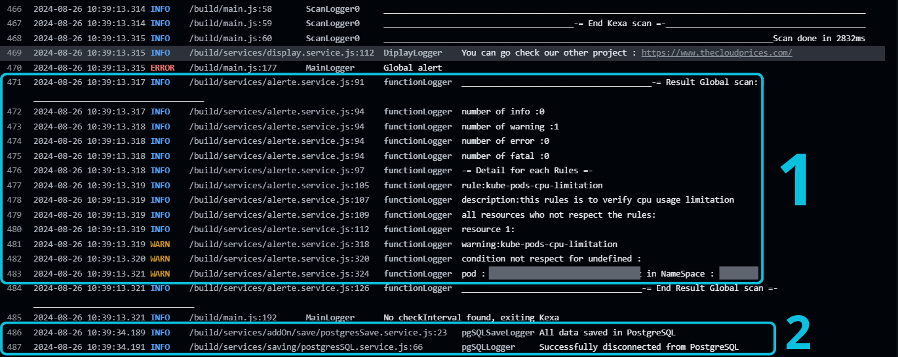
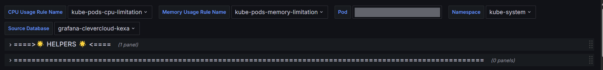

# Kexa's Grafana Dashboards

<br/>
<br/>

<div align="center" id="top">

  <a href="https://www.kexa.io/">
    
  </a>
  <a href="https://grafana.com/">
    
  </a>
</div>

<br/>
<br/>

Collection of Grafana dashboards to work with Kexa, help you monitoring &amp; visualize for low costs, by using data
from Kexa to be visualized and monitored.

Want more information on Kexa project ? 
Check the Open Source repository : https://github.com/4urcloud/Kexa

<br/>
<br/>


<summary>Table of Contents</summary>
  <ol>
    <li>
      <a href="#examples">Examples dashboards</a>
	  <ul>
        <li><a href="#addon">Kexa's main</a></li>
        <li><a href="#kube">Kubernetes</a></li>
      </ul>
    </li>
    <li>
      <a href="#setup">Setting up</a>
      <ul>
        <li><a href="#basic-setup">Basic setup (mandatory)</a></li>
        <li><a href="#addon-setup">Kexa main dashboards</a></li>
        <li><a href="#kube-setup">Kubernetes dashboards</a></li>
      </ul>
    </li>
    <li>
      <a href="#dashboard-explanation">Dashboards Explanations</a>
    </li>
    <li><a href="#license">License</a></li>
    <li><a href="#contact">Contact</a></li>
</ol>

<br/>
<br/>

# <h2 align="center" id="examples">Example dashboards</h2>

## <h3 align="left" id="addon"> Kexa main dashboard</h3>
<div align="center">
    
</div>
<br/>

## <h3 align="left" id="kube"> Kexa kubernetes dashboards</h3>
<div align="center">
    
</div>
<br/>
<div align="center">
    
</div>
<br/>
<div align="center">
    
</div>
<br/>
<br/>
<br/>

# <h2 align="center" id="setup">Setting up</h2>

To set up Grafana dashboards for Kexa, you first need to use the Postgres or MySQL saving option from Kexa.

This will allow you to save your scans data in this database, and then Grafana will retrieve data from it.

Then you can follow indications for the dashboard you want to use.

<br/>

## <h3 align="left" id="basic-setup">Data saving setup</h3>

Kexa read configuration files from '*./config/*' folder, here is a few links to know more about how Kexa work :

- [Kexa Ready to Run for Git Action repository (with tuturial in readme)](https://github.com/4urcloud/Kexa_Action_ReadyToRun)
- [Kexa repository](https://github.com/4urcloud/Kexa)
- [Kexa full documentation](https://github.com/4urcloud/Kexa/blob/main/documentation/Documentation-Kexa.md)

So in your configuration file, you can add the 'potgres' or 'mysql' save option :

```json
{
    "save": [
        {
            "type": "postgres",
            "name": "my_database",
            "description": "Database to save the data",
            "urlName": "postgres://yourDatabaseConnectionString"
        }
    ]
}
```

- type: The save option you want to use , '*postgres*' or '*mysql*'
- name: name of your database
- description: the database to save the data
- urlName: the connection string for your database ( *warning: keep your crendentials private* )

The database will be constructed automatically on first Kexa launch.

You can check the Kexa logs to get the results and debug data saving:

<div align="center">
    
</div>

- 1 : Result of the scan, with resource information for remediation.
- 2 : Export success confirmed

<br/>

Once your results have been exported, you can launch Grafana, for example, if you used the docker local run, you can go to : http://localhost:3000/


You will need to add your database used for Kexa data saving to your Grafana dashboard as a new data source :

- Adding a Postgres data source : [PostgreSQL data source | Grafana documentation](https://grafana.com/docs/grafana/latest/datasources/postgres/)

- Adding a MySql data source : [MySQL data source | Grafana documentation](https://grafana.com/docs/grafana/latest/datasources/mysql/)

<br/>

## <h3 align="left" id="kube-setup">Kubernetes dashboard</h3>

At the top of this dashboard, you will see a few dropdown menus. Here is the explanation for each one :

<div align="center">
    
</div>

The two following need to be set up correctly for the dashboard to work :

- "CPU Usage Rule Name": The Kexa rule name that check for CPU usage peaks
- "Memory Usage Rule Name": The Kexa rule name that check for Memory usage peaks.

Those drop down lists are generated by the retrieved Kexa data, if no rules are showing in those two drop down lists, that means Kexa hasn't saved the data or rules are not applied.

You should select for CPU & Memory, the associated rule for peaks alerts, as mentioned before, you can retrieve the whole rule file for this tutorial here :
[Kexa_Action_ReadyToRun/rules/kubernetesConsumptions.yaml at main · 4urcloud/Kexa_Action_ReadyToRun (github.com)](https://github.com/4urcloud/Kexa_Action_ReadyToRun/blob/main/rules/kubernetesConsumptions.yaml).

So by default the "*CPU Usage Rule Name*" is "*kube-pods-cpu-limitations*" and the "*Memory Usage Rule Name*" is "*kube-pods-memory-limitation*", if you're using another rule, please select the associated one.

- "Source Database" : Choose your datasource where Kexa data are located
- "Namespace" : Choose the namespace to scan
- "Pod" : Choose the pod to analyse data from

Once all is selected, the dashboard will be refreshed with the new data.

### <h4 align="left" id="kube-setup">Expected Results</h4>


The first section is called “*SELECTED POD*”, and contains all the analysis data for the selected pod, with CPU analysis on the left and Memory analysis on the right.

It has been made to help you set your limits & requests, as well as monitoring CPU & memory usages.

<div align="center">
    
</div>

- **Limit Total & Request Total**: Your current configuration for limits & requests
- **Usage charts**: Representing the usage per scan on a timeline, and comparing the usage with the request & limit.
- **Optimization scores**: A score based on the range between request & limit and the distance between the current usage and those two points. It is just an indication to have a quick view, refer to the graph above for more understanding.

You need to configure your limits & requests to get an optimization score.

Below the optimization scores, you will see a panel with the minimum usage over the selected period, as well as the maximum and the average.

We have also included average deviation and min/max range, and on the right of those statistics, you have the list of Kexa peaks alerts raised.

<div align="center">
    
</div>

Next, you have the "*CONSUMPTION PEAKS*" section, used to help you schedule your pods:

<div align="center">
    
</div>

- **A heatmap**: Taking all data over time to make an average usage per week day and hour so you can know where the usage is the highest or lowest in average.
- **Day/Hour peaks & bottoms**: Important data from the heatmap
- **Alert list**: List of all alerts concerning the memory or CPU usage, so you can easily find pods to analyse.

<br/>

## <h3 align="left" id="addon-setup">Main dashboard (coming soon)</h3>


<br/>


<br/>
